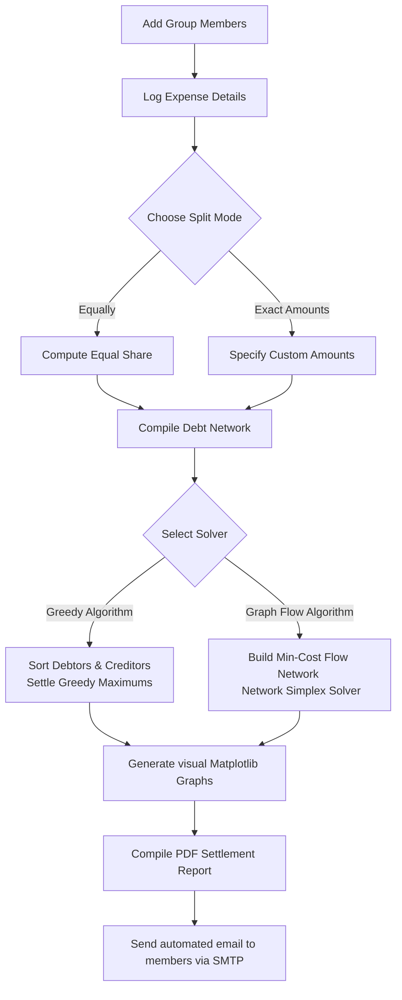
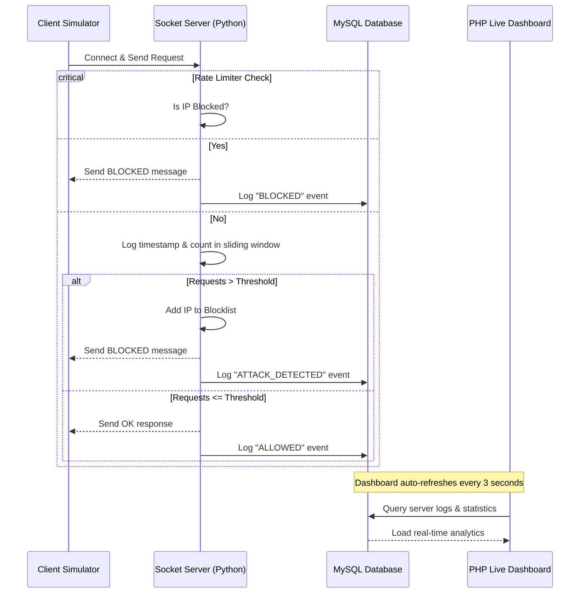

# 💸 Cash Flow Minimizer & 🛡️ DoS Protection System

<div align="center">

[](https://www.python.org/)
[](https://streamlit.io/)
[](https://www.mysql.com/)
[](https://www.php.net/)
[](LICENSE)

*A premium double-featured repository featuring a **Cash Flow Minimizer** (Streamlit GUI + CLI) and a **DoS/DDoS Attack Simulation & Protection System** with a Live PHP Web Dashboard.*

</div>

---

## 📖 Table of Contents
- [🚀 Overview](#-overview)
- [💸 Project 1: Cash Flow Minimizer](#-project-1-cash-flow-minimizer)
  - [🌟 Key Features](#-key-features)
  - [🗺️ System Architecture](#️-system-architecture-cash-flow)
  - [⚙️ How the Algorithms Work](#️-how-the-algorithms-work)
- [🛡️ Project 2: DoS Simulation & Protection System](#️-project-2-dos-simulation--protection-system)
  - [🌟 Key Features](#-key-features-1)
  - [🗺️ System Architecture](#️-system-architecture-dos-system)
- [📁 Folder Structure](#-folder-structure)
- [🛠️ Tech Stack & Dependencies](#️-tech-stack--dependencies)
- [📥 Installation & Setup](#-installation--setup)
- [💻 Usage Guide](#-usage-guide)
  - [Running Cash Flow Minimizer](#running-cash-flow-minimizer)
  - [Running DoS Protection System](#running-dos-protection-system)
- [📄 License & Authors](#-license--authors)

---

## 🚀 Overview

This repository hosts two distinct and highly robust projects:

1. **💸 Cash Flow Minimizer**: A complete splitwise-like application to resolve group debts. It computes optimal settlements using both a **Greedy Algorithm** and a **Min-Cost Max-Flow Network Simplex Algorithm**, renders debt graphs, outputs a professional PDF report, and automatically emails the results to all group members.
2. **🛡️ DoS Simulation & Protection**: A socket-based security system demonstrating a sliding-window rate-limiting firewall, automatic IP blocking, MySQL logging, a multi-threaded attack simulator, and a live web monitoring dashboard.

> [!NOTE]
> Both projects showcase robust implementations of algorithms, networking, and security concepts in practical real-world scenarios.

---

## 💸 Project 1: Cash Flow Minimizer

A comprehensive solution to minimize the total number of cash transactions needed to settle a group's expenses. It eliminates redundant debt relations by simplifying the transaction network.

### 🌟 Key Features
- **👥 Group & Member Management**: Quickly register members with names and email addresses.
- **💳 Advanced Expense Logging**: Support for split-types: **Equally** or **Exact Amounts** for custom individual spendings.
- **⚙️ Dual Optimization Solvers**:
  - **Greedy Minimizer**: Standard optimal matching algorithm by matching the largest debtor with the largest creditor.
  - **Graph Flow Minimizer**: Utilizes **Network Simplex** (Minimum Cost Flow) to model cash flow networks and optimize transactions.
- **📊 Debt Network Visualizations**: Interactive graph plotting (before & after minimization) using **NetworkX** and **Matplotlib**.
- **📄 PDF Settlement Reports**: Generates professional PDF invoices/reports featuring group details, expenses, and graph structures.
- **📧 SMTP Email Dispatcher**: Automated reports sent directly to all group members' emails via SMTP.

### 🗺️ System Architecture (Cash Flow)



### ⚙️ How the Algorithms Work

#### 1. Greedy Algorithm
This approach simplifies debts by balancing individual nets (credits minus debits):
1. Calculates the net balance of each group member.
2. Divides members into **Debtors** (net < 0) and **Creditors** (net > 0).
3. Sorts debtors in ascending order and creditors in descending order.
4. Greedily matches the largest debtor with the largest creditor, resolving the maximum possible balance between the two.
5. Repeats this process until all balances are settled, minimizing the absolute number of transactions.

#### 2. Graph Flow Algorithm (Min-Cost Flow)
A network flow representation using the NetworkX implementation of the **Network Simplex** algorithm:
1. Constructs a directed graph where nodes represent people and directed edges denote transactions.
2. A virtual `__SOURCE__` node is connected to all Creditors (capacity = credit balance, cost/weight = 0).
3. A virtual `__SINK__` node is connected to all Debtors (capacity = absolute debt balance, cost/weight = 0).
4. Members are connected by transaction edges (capacity = transaction amount, cost/weight = 1).
5. The algorithm solves the Minimum Cost Flow problem, producing the most optimized transaction routes.

---

## 🛡️ Project 2: DoS Simulation & Protection System

A practical implementation showcasing how to protect backend TCP servers against DDoS/flooding attacks.

### 🌟 Key Features
- **⚡ Sliding-Window Rate Limiter**: Monitors requests from incoming IPs within a sliding time window.
- **🚫 Automated IP Blocking**: Temporarily bans malicious IPs when thresholds are violated.
- **🗄️ MySQL Database Logger**: Logs every single request status (`ALLOWED`, `ATTACK_DETECTED`, `BLOCKED`) to track traffic.
- **📈 PHP Live Dashboard**: An auto-refreshing admin frontend displaying real-time server load statistics, request status logs, and top attacker IPs.
- **💥 Multithreaded Client Simulator**: Simulates high-velocity traffic and stress tests defenses.

### 🗺️ System Architecture (DoS System)



---

## 📁 Folder Structure

Here is an overview of the key files in the repository:

```text
├── main.py                     # Cash Flow CLI Entry Point
├── streamlit_app.py            # Cash Flow Web App (Streamlit)
├── greedy_algorithm.py         # Greedy Solver Implementation
├── graph_flow_algorithm.py     # Min-Cost Flow Solver Implementation
├── generate_pdf_report         # PDF Generation Utilities (FPDF2)
├── server.py                   # Socket Server with Sliding Window Rate Limiting
├── client.py                   # Socket Client (DoS Stress Testing Tool)
├── config.py                   # Mail Server Settings
├── live_dashboard.php          # Real-time Web Analytics (PHP)
├── requirements.txt            # Python dependencies
└── static/                     # Image outputs and graph assets
```

---

## 🛠️ Tech Stack & Dependencies

| Tool / Library | Category | Description |
| :--- | :--- | :--- |
| **Streamlit** | Frontend / GUI | Renders the interactive Cash Flow Minimizer web dashboard |
| **NetworkX** | Algorithms | Models flow networks and executes Network Simplex |
| **Matplotlib** | Data Visualization | Generates directed graph diagrams of transactions |
| **fpdf2** | Reporting | Compiles structured, professional PDF invoices and reports |
| **Pandas & NumPy** | Data Wrangling | Manages balances and matrix calculations |
| **MySQL** | Database | Stores firewall & request status logs |
| **PHP** | Backend | Drives the live analytics dashboard for DoS events |

---

## 📥 Installation & Setup

### Prerequisites
- Python 3.8 or above installed.
- XAMPP / WampServer (or separate installations of Apache + MySQL).

### 1. Clone the Repository
```bash
git clone https://github.com/Lokeshwar-09/Cash-Flow-Minimizer.git
cd Cash-Flow-Minimizer
```

### 2. Install Python Dependencies
```bash
pip install -r requirements.txt
```

### 3. SMTP Email Configuration
Update your SMTP server login credentials in `config.py`:
```python
GMAIL_USER = "your-email@gmail.com"
GMAIL_PASSWORD = "your-app-password"
```

---

## 💻 Usage Guide

### Running Cash Flow Minimizer

#### Option A: Streamlit Web UI (Recommended)
```bash
streamlit run streamlit_app.py
```

#### Option B: Command Line Interface (CLI)
```bash
python main.py
```

---

### Running DoS Protection System

#### 1. Setup the Database
1. Launch **XAMPP Control Panel** and start **Apache** & **MySQL**.
2. Open phpMyAdmin (`http://localhost/phpmyadmin/`) and create a database named `dos_project`.
3. Execute the following SQL query to create the logging table:
   ```sql
   CREATE TABLE socket_logs (
       id INT AUTO_INCREMENT PRIMARY KEY,
       ip_address VARCHAR(45) NOT NULL,
       status VARCHAR(20) NOT NULL,
       request_count INT DEFAULT 1,
       log_time TIMESTAMP DEFAULT CURRENT_TIMESTAMP
   );
   ```

#### 2. Deploy the PHP Dashboard
1. Copy `live_dashboard.php` into your Apache public folder (e.g., `C:/xampp/htdocs/dashboard/`).
2. Access the real-time panel at: `http://localhost/dashboard/live_dashboard.php`.

#### 3. Start the Secure Server
Run the TCP server to start listening for client packets and monitoring incoming rates:
```bash
python server.py
```

#### 4. Launch the DoS Attack Simulation
Run the client thread simulator to generate massive traffic loads and watch the firewall in action on the PHP dashboard:
```bash
python client.py
```

---

## 📄 License & Authors

- **License**: This project is licensed under the [MIT License](LICENSE).
- **Author**: **N. Lokeshwar** (24020)
