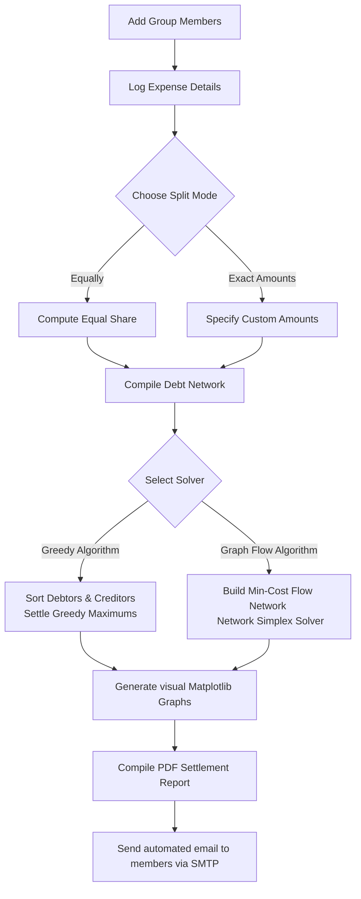
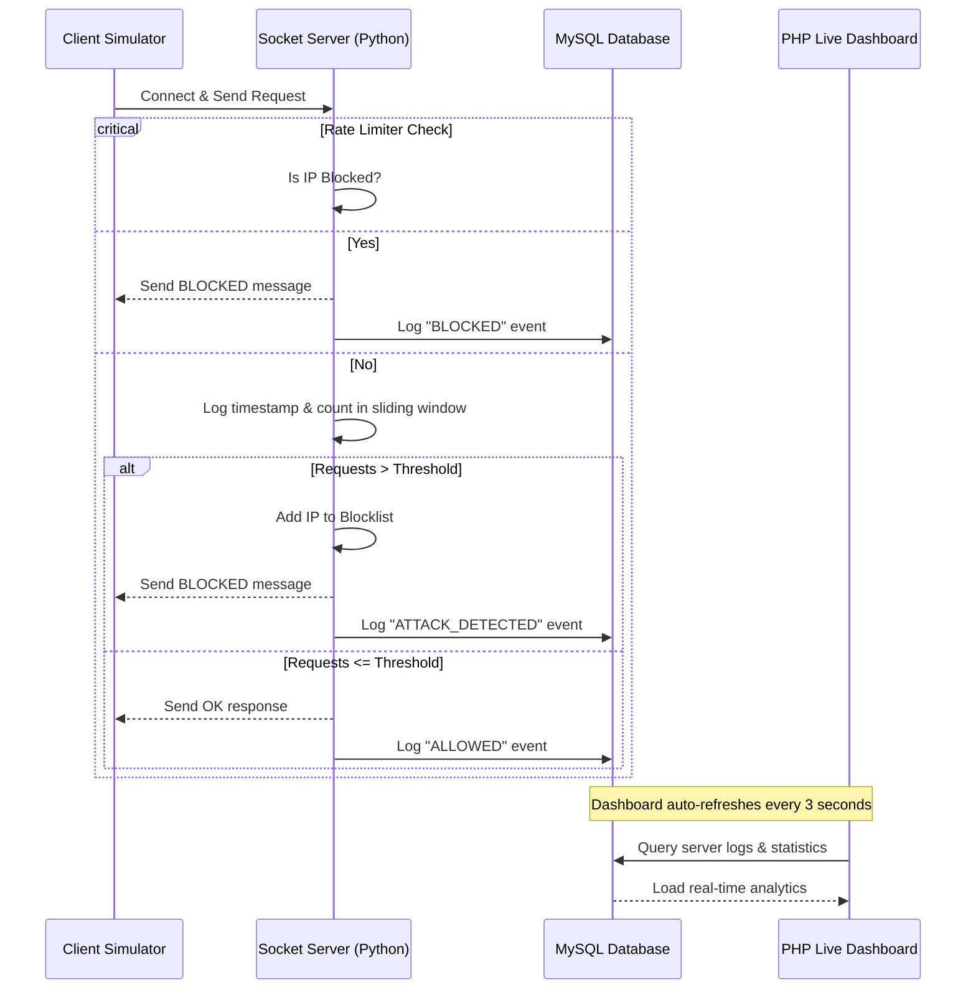

# 💸 Cash Flow Minimizer & 🛡️ DoS Protection System

Double-featured repository containing a premium **Cash Flow Minimizer** (Streamlit GUI + CLI) and a **DoS/DDoS Attack Simulation & Protection System** with a Live PHP Web Dashboard.

---

## 🚀 Projects Overview

This repository hosts two distinct projects:

1. **💸 Cash Flow Minimizer**: A complete splitwise-like application to resolve group debts. It computes optimal settlements using both a **Greedy Algorithm** and a **Min-Cost Max-Flow Network Simplex Algorithm**, renders debt graphs, outputs a professional PDF report, and automatically emails the results to all group members.
2. **🛡️ DoS Simulation & Protection**: A socket-based security system demonstrating a sliding-window rate-limiting firewall, automatic IP blocking, MySQL logging, a multi-threaded attack simulator, and a live web monitoring dashboard.

---

## 💸 Cash Flow Minimizer

A robust utility built to minimize the number of cash transactions needed to settle a group's expenses. 

### 🌟 Key Features
- **👥 Group & Member Management**: Quickly register members with names and email addresses.
- **💳 Advanced Expense Logging**: Support for split-types: **Equally** or **Exact Amounts** for custom individual spendings.
- **⚙️ Dual Optimization Algorithms**:
  - **Greedy Minimizer**: Standard optimal matching algorithm by matching the largest debtor with the largest creditor.
  - **Graph Flow Minimizer**: Utilizes **Network Simplex** (Minimum Cost Flow) to model cash flow networks and optimize transactions.
- **📊 Debt Network Visualizations**: Interactive graph plotting (before & after minimization) using **NetworkX** and **Matplotlib**.
- **📄 PDF Settlement Reports**: Generates professional PDF invoices/reports featuring group details, expenses, and graph structures.
- **📧 SMTP Email Dispatcher**: Automated reports sent directly to all group members' emails via SMTP.

---

### 🗺️ System Architecture (Cash Flow)



---

### ⚙️ How the Algorithms Work

#### 1. Greedy Algorithm
This approach simplifies debts by balancing individual nets (credits minus debits):
1. Calculates the net balance of each group member.
2. Divides members into **Debtors** (net < 0) and **Creditors** (net > 0).
3. Sorts debtors in ascending order and creditors in descending order.
4. Greedily matches the largest debtor with the largest creditor, resolving the maximum possible balance between the two.
5. Repeats this process until all balances are settled, minimizing the absolute number of transactions.

#### 2. Graph Flow Algorithm (Min-Cost Flow)
A network flow representation using the NetworkX implementation of the **Network Simplex** algorithm:
1. Constructs a directed graph where nodes represent people and directed edges denote transactions.
2. A virtual `__SOURCE__` node is connected to all Creditors (capacity = credit balance, cost/weight = 0).
3. A virtual `__SINK__` node is connected to all Debtors (capacity = absolute debt balance, cost/weight = 0).
4. Members are connected by transaction edges (capacity = transaction amount, cost/weight = 1).
5. The algorithm solves the Minimum Cost Flow problem, producing the most optimized transaction routes.

---

## 🛡️ DoS Simulation & Protection System

A practical implementation showcasing how to protect backend TCP servers against DDoS/flooding attacks.

### 🌟 Key Features
- **⚡ Sliding-Window Rate Limiter**: Monitors requests from incoming IPs within a sliding time window.
- **🚫 Automated IP Blocking**: Temporarily bans malicious IPs when thresholds are violated.
- **🗄️ MySQL Database Logger**: Logs every single request status (`ALLOWED`, `ATTACK_DETECTED`, `BLOCKED`) to track traffic.
- **📈 PHP Live Dashboard**: An auto-refreshing admin frontend displaying real-time server load statistics, request status logs, and top attacker IPs.
- **💥 Multithreaded Client Simulator**: Simulates high-velocity traffic and stress tests defenses.

---

### 🗺️ System Architecture (DoS System)



---

## 🛠️ Tech Stack & Dependencies

- **Programming Languages**: Python, PHP, SQL
- **Streamlit Web Framework**: Interactive GUI
- **Libraries**:
  - `networkx`
  - `matplotlib`
  - `fpdf2`
  - `pandas`
  - `numpy`
- **Database**: MySQL
- **Web Server Backend**: XAMPP / Apache

---

## 📥 Installation & Setup

### Prerequisites
- Python 3.8 or above installed on your local system.
- XAMPP or any local stack providing Apache + MySQL.

### 1. Clone the Repository
```bash
git clone https://github.com/Lokeshwar-09/Cash-Flow-Minimizer.git
cd Cash-Flow-Minimizer
```

### 2. Install Python Dependencies
```bash
pip install -r requirements.txt
```

### 3. SMTP Email Configuration
Modify credentials in `config.py`, `streamlit_app.py`, and `main.py`:

```python
SENDER_EMAIL = "your-email@gmail.com"
APP_PASSWORD = "your-app-password"
```

---

## 💻 How to Run the Applications

### Project 1: Cash Flow Minimizer

#### Option A: Run Streamlit Web Application
```bash
streamlit run streamlit_app.py
```

#### Option B: Run Command-Line Interface (CLI)
```bash
python main.py
```

---

### Project 2: DoS Simulation & Protection System

#### 1. Setup the Database
1. Start XAMPP Control Panel and start **Apache** & **MySQL**.
2. Create a database named `dos_project`.
3. Create a table named `socket_logs`:
   ```sql
   CREATE TABLE socket_logs (
       id INT AUTO_INCREMENT PRIMARY KEY,
       ip_address VARCHAR(45) NOT NULL,
       status VARCHAR(20) NOT NULL,
       request_count INT DEFAULT 1,
       log_time TIMESTAMP DEFAULT CURRENT_TIMESTAMP
   );
   ```

#### 2. Deploy the PHP Dashboard
Copy `live_dashboard.php` into your local Apache root folder (`htdocs/dashboard/`).
Access the page:
`http://localhost/dashboard/live_dashboard.php`

#### 3. Run the TCP Server
```bash
python server.py
```

#### 4. Launch the DoS Attack Simulation
```bash
python client.py
```

---

## 📄 License & Authors

- **License**: This project is licensed under the [MIT License](file:///e:/sem%204/Codes/Cash%20Flow/LICENSE).
- **Author**: **N. Lokeshwar** (24020)
